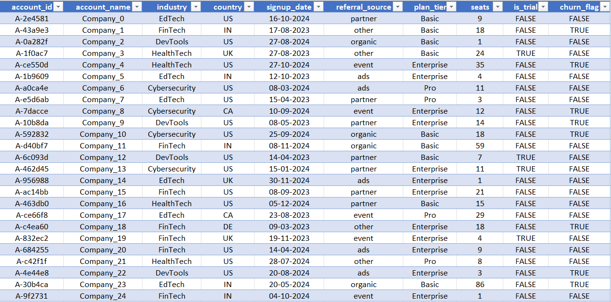
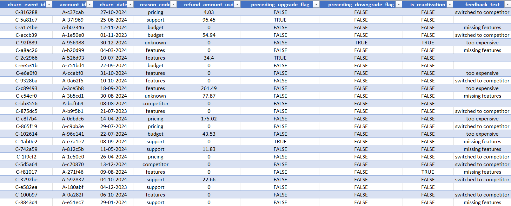
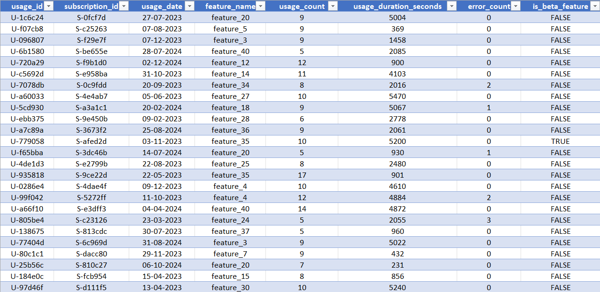
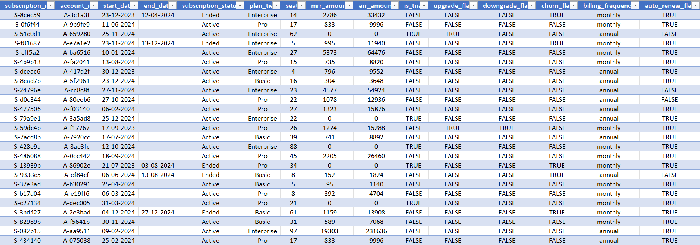
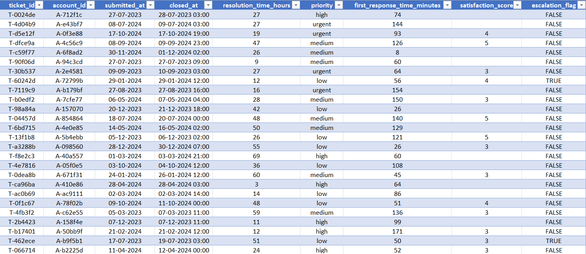
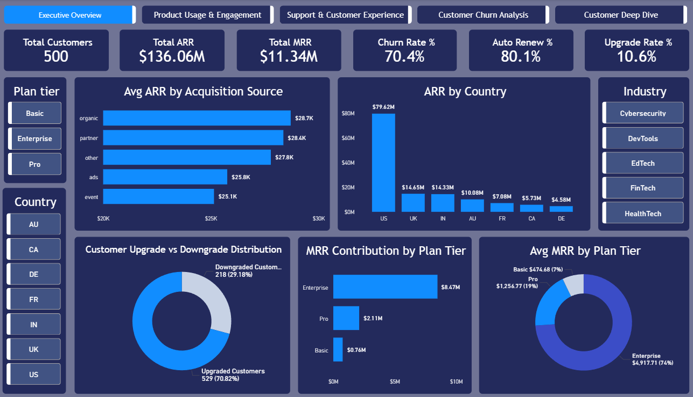
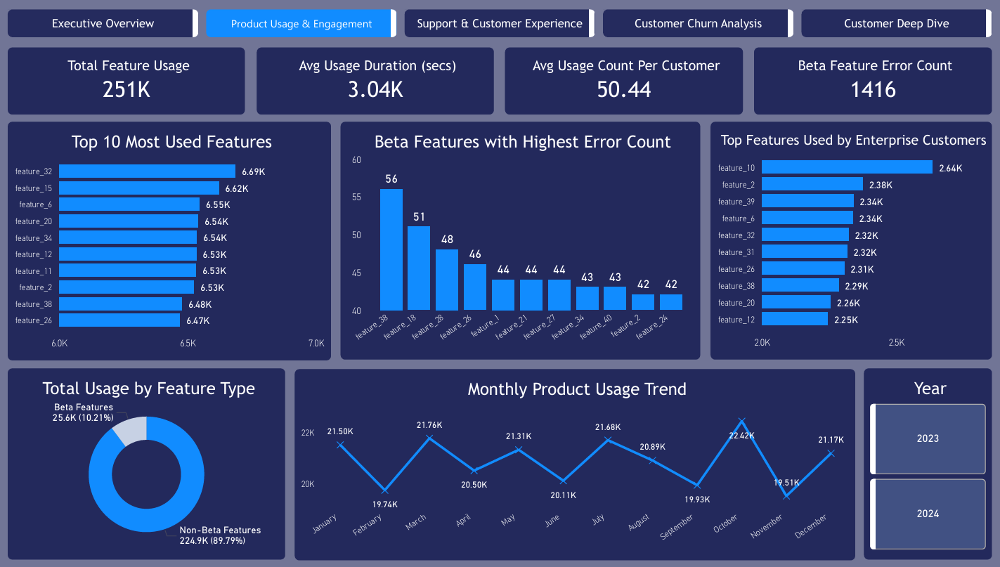
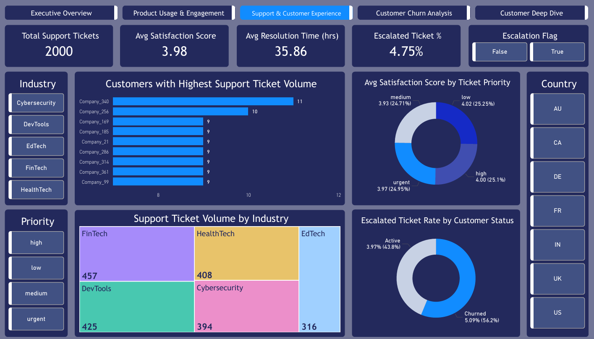
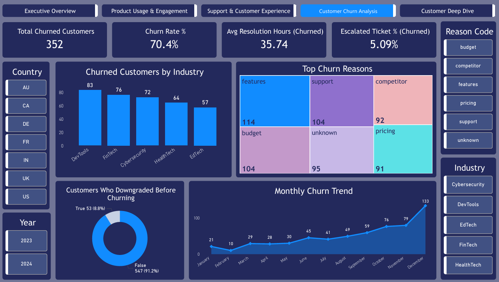
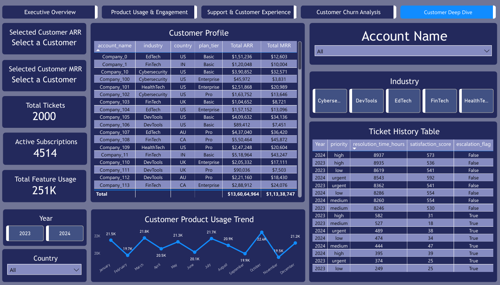

# Saas Customer Churn Subscription Product Usage Analysis

## Project Overview

This project analyzes a SaaS company's customer, subscription, support ticket, and product usage data to uncover the reasons behind customer churn and identify opportunities to improve retention, engagement, and revenue.

The analysis combines SQL, Excel, and Power BI to answer critical business questions such as:

- Which industries have the highest churn rate?
- Do churned customers use the product less than active customers?
- Which plan tier generates the highest monthly recurring revenue?
- What are the most common churn reasons?
- Does support quality influence churn?
- How is churn changing over time?

### The project includes:

- Data cleaning and preparation in Excel and Power Query
- SQL analysis across multiple related tables
- A relational data model connecting five related tables in Power BI
- Five interactive dashboard pages focused on churn, revenue, customer behavior, support, and deep-dive customer analysis
- Business recommendations based on data-driven findings

The goal of this project is not only to visualize performance, but to demonstrate how an analyst can connect customer behavior, support experience, product usage, and revenue into a complete business story.

---

## Executive Summary

The business is experiencing critically high churn (70.4%), putting over $11.34M in MRR at risk.

Enterprise customers contribute 75% of total revenue, yet also show the highest churn exposure, making retention a top financial priority.

Contrary to common assumptions, churn is not driven by low usage alone. Customers who churn exhibit similar usage levels but significantly higher support escalations and dissatisfaction.

The primary churn drivers are:
- Feature gaps
- Poor support experience
- High issue escalation rates

To reduce churn, the business must prioritize:
1. Enterprise customer retention programs
2. Fixing high-error and high-demand features
3. Proactive support intervention for high-risk accounts
 
---

## Business Context

Customer churn is one of the biggest challenges for SaaS businesses because losing customers directly reduces recurring revenue and increases customer acquisition costs.

The company in this dataset offers different subscription plans to customers across multiple industries. Customers interact with the product in different ways, raise support tickets, upgrade or downgrade plans, and sometimes cancel their subscriptions.

However, the business does not clearly understand:

- Which customers are most likely to churn
- Whether low product usage is linked to churn
- Whether support issues increase the risk of losing customers
- Which subscription plans contribute the most revenue
- Which churn reasons should be prioritized first

Without this information, the company risks losing high-value customers, focusing on the wrong problems, and missing opportunities to improve retention.

This project was created to help the business move from reacting to churn after it happens to proactively identifying risk patterns before customers leave.

---

## Business Objectives

The primary objective of this project is to identify the factors that influence customer churn and provide insights that can improve retention, increase recurring revenue, and strengthen customer engagement.

Specific objectives include:

- Measure overall churn performance and identify which customer groups have the highest churn rate.
- Compare product usage behavior between churned and active customers.
- Analyze whether customers downgrade their plans before churning.
- Determine which subscription plans generate the highest Monthly Recurring Revenue (MRR) and Annual Recurring Revenue (ARR).
- Identify the most common churn reasons and track how churn changes over time.
- Build an interactive dashboard that allows business users to explore customer-level details and specific accounts using slicers and page navigation.
- Provide clear business recommendations to reduce churn and improve customer retention.

---

## Dataset Preview

## Accounts Table

## Dataset Information

| Attribute | Details |
| --- | --- |
| Table Name | `accounts` |
| Description | Contains customer account details such as company name, industry, country, and referral source. |
| Primary Key | `account_id` |
| Foreign Keys | Referenced by `subscriptions.account_id`, `support_tickets.account_id`, and `customer_churn.account_id` |
| Key Columns | `account_id`, `account_name`, `industry`, `country`, `referral_source` |
| Used For | Churn rate by industry, ARR by country, referral source analysis, customer-level ticket analysis |

---

## Customer Churn Table

## Dataset Information

| Attribute | Details |
| --- | --- |
| Table Name | `customer_churn` |
| Description | Contains churn-related information for customers who cancelled or ended their subscriptions. |
| Primary Key | `account_id` |
| Foreign Keys | `account_id` → `accounts.account_id` |
| Key Columns | `account_id`, `reason_code`, `preceding_downgrade_flag` |
| Used For | Churn reason analysis, downgrade-before-churn analysis, churn rate calculations |

---

## Product Usage Table

## Dataset Information

| Attribute | Details |
| --- | --- |
| Table Name | `product_usage` |
| Description | Stores feature-level product usage data for each subscription, including usage duration, frequency, beta feature usage, and errors. |
| Primary Key | Composite Key: `subscription_id` + `feature_name` |
| Foreign Keys | `subscription_id` → `subscriptions.subscription_id` |
| Key Columns | `subscription_id`, `feature_name`, `usage_count`, `usage_duration_seconds`, `is_beta_feature`, `error_count` |
| Used For | Feature usage analysis, churn vs usage comparison, beta feature analysis, usage segmentation |

---

## Subscriptions Table

## Dataset Information

| Attribute | Details |
| --- | --- |
| Table Name | `subscriptions` |
| Description | Contains subscription plan, revenue, upgrade, downgrade, renewal, and churn information for each customer subscription. |
| Primary Key | `subscription_id` |
| Foreign Keys | `account_id` → `accounts.account_id` |
| Key Columns | `subscription_id`, `account_id`, `plan_tier`, `mrr_amount`, `arr_amount`, `upgrade_flag`, `downgrade_flag`, `auto_renew_flag`, `churn_flag`, `end_date`, `subscription_status` |
| Used For | MRR and ARR analysis, churn by plan tier, upgrade and downgrade analysis, active vs churned customer comparison |

---

## Support Tickets Table

## Dataset Information

| Attribute | Details |
| --- | --- |
| Table Name | `support_tickets` |
| Description | Contains support ticket activity, including ticket priority, escalation, satisfaction score, and resolution time. |
| Primary Key | `ticket_id` |
| Foreign Keys | `account_id` → `accounts.account_id` |
| Key Columns | `ticket_id`, `account_id`, `priority`, `satisfaction_score`, `resolution_time_hours`, `escalation_flag` |
| Used For | Support performance analysis, ticket volume, escalation rate, satisfaction analysis, churn vs support relationship |

---

## DAX Calculations

- Total Customers = DISTINCTCOUNT(customer_accounts[account_id])

- Total ARR = SUM(customer_subscriptions[arr_amount])

- Total MRR = SUM(customer_subscriptions[mrr_amount])

- Churn Rate = DIVIDE(DISTINCTCOUNT(customer_churn_details[account_id]),DISTINCTCOUNT(customer_accounts[account_id]))

- Auto Renew % = DIVIDE([Auto Renew Customers], COUNTROWS(customer_subscriptions), 0)

- Upgrade Rate % = DIVIDE([Upgraded Customers], COUNTROWS(customer_subscriptions), 0)

- Plan Tier Churn % = DIVIDE(CALCULATE(COUNTROWS(customer_subscriptions),customer_subscriptions[churn_flag] = TRUE()),COUNTROWS(customer_subscriptions),0)

- Upgraded Customers = CALCULATE(COUNTROWS(customer_subscriptions),customer_subscriptions[upgrade_flag] = TRUE())

- Downgraded Customers = CALCULATE(COUNTROWS(customer_subscriptions),customer_subscriptions[downgrade_flag] = TRUE())

- Total Feature Usage = SUM(product_usage_metrics[usage_count])

- Average Usage Duration = AVERAGE(product_usage_metrics[usage_duration_seconds])

- Avg Usage Count per Subscription = DIVIDE(SUM(product_usage_metrics[usage_count]),DISTINCTCOUNT(product_usage_metrics[subscription_id]),0)

- Beta Feature Error Count = CALCULATE(SUM(product_usage_metrics[error_count]),product_usage_metrics[is_beta_feature] = TRUE())

- Average Satisfaction = AVERAGE(customer_support_tickets[satisfaction_score])

- Average Resolution Time = AVERAGE(customer_support_tickets[resolution_time_hours])

- Escalated Ticket % = DIVIDE(CALCULATE(COUNTROWS(customer_support_tickets),customer_support_tickets[escalation_flag] = TRUE()),COUNTROWS(customer_support_tickets),0)

- Churned Customers = DISTINCTCOUNT(customer_churn_details[account_id])

- Avg Resolution Time (Churned) = ROUND(CALCULATE(AVERAGE(customer_support_tickets[resolution_time_hours]),customer_support_tickets[Customer Status] = "Churned"),2)

- Escalated Ticket % (Churned) = CALCULATE(AVERAGEX(customer_support_tickets, IF(customer_support_tickets[escalation_flag] =    TRUE(),1,0)),customer_support_tickets[Customer Status] = "Churned")

- Churn Count = CALCULATE(COUNT(customer_churn_details[account_id]),customer_subscriptions[churn_flag] = TRUE())

- Selected Customer ARR Display = IF(HASONEVALUE(customer_accounts[account_name]),FORMAT([Selected Customer ARR], "$#,##0"),"Select a Customer")

- Selected Customer MRR Display = IF(HASONEVALUE(customer_accounts[account_name]),FORMAT([Selected Customer MRR], "$#,##0"),"Select a Customer")

- Total Feature Usage = SUM(product_usage_metrics[usage_count])

**Note: Table names in DAX are prefixed (customer_) for clarity within the Power BI model.**

---

## SQL Analysis

The SQL analysis was performed using five related datasets: accounts, subscriptions, product usage, support tickets, and customer churn. These tables were connected through account_id and subscription_id to investigate the relationship between customer behavior, revenue, support experience, and churn.

The analysis focused on identifying which customers generate the most value, which customers are most likely to churn, and what business factors are driving that churn.

### 1. Which plan tier generates the highest total MRR?

This query measures which subscription plan contributes the most recurring revenue.

**Key Finding:**

- Enterprise customers contribute the majority of total MRR ($8.47M), creating significant revenue concentration risk if churn is not controlled in this segment.
- Pro contributed around $2.11M.
- Basic contributed only $0.76M.

**Business Insight:** Enterprise customers are the core revenue driver, contributing most to the total monthly recurring revenue. Retaining these customers should be the top business priority because even a small increase in Enterprise churn would have a major revenue impact.

---
### 2. Which industries have the highest churn rate?

This query compared churn rate in each industry.

**Key Finding:**

- DevTools represents a high-risk segment with the highest churn rate (73.45%), indicating potential product-market misalignment and increased revenue leakage.
- EdTech followed with 72.15% churn rate.
- Cybersecurity had 72% churn rate.

**Business Insight:** DevTools, EdTech, and Cybersecurity had the highest churn rates, which means these industries are losing a larger percentage of customers than any other segment. This suggests the product may not be meeting the specific needs of these industries. These segments should be prioritized for deeper investigation, targeted retention campaigns, feature improvements, and dedicated customer success support.

---
### 3. Which countries bring the most ARR?

This query measured annual recurring revenue by customer country.

**Key Finding:**

- The United States generated the highest ARR at approximately $79.62M.
- The United Kingdom and India followed with $14.65M and $14.33M.

**Business Insight:** The business is heavily dependent on the United States market, which contributes more than half of total ARR. This concentration increases risk and suggests the company should diversify growth into other regions.

---
### 4. Which referral sources generate the highest-value customers?

This query analyzed average ARR by acquisition source.

**Key Finding:**

- Organic acquisition generated the highest-value customers with an average ARR of $28.7K.
- Partner referrals followed at $28.4K.
- Event-based acquisition produced the lowest-value customers at $25.1K.

**Business Insight:** Organic and partner channels attract customers with higher long-term value. Marketing investment should shift toward these sources rather than lower-performing channels.

---
### 5. Which plan tier has the highest average monthly recurring revenue (MRR) per customer?

This query compared average monthly recurring revenue per customer across plan tiers.

**Key Finding:** Enterprise customers had the highest average MRR per customer, significantly above Pro and Basic plans.

**Business Insight:** Enterprise accounts not only generate the most total revenue, but also the highest revenue per customer. Losing a single Enterprise customer is far more damaging than losing multiple Basic customers.

---
### 6. How many customers upgraded vs downgraded?

**Key Finding:**
- 529 customers upgraded.
- 218 customers downgraded.

**Business Insight:** The number of upgraded customers is more than twice the number of downgraded customers, which suggests that many customers are finding enough value in the product to move to higher-tier plans. This is a strong sign of product-market fit and successful expansion within the existing customer base. The company should analyze what drives these upgrades—such as specific features, industries, or usage patterns—and use those insights to encourage more customers to move up.

---

## Additional Analysis

### 7. Which plan has the highest upgrade rate?

**Key Finding:**

- Pro: 11.58
- Enterprise: 11.26
- Basic: 8.80

**Business Insight:** Pro customers have the highest upgrade rate, which suggests that customers on the Pro plan are most likely to see enough value to move to Enterprise. The Pro tier appears to be the strongest conversion stage in the subscription journey. The company should focus on identifying which features or usage patterns drive Pro customers to upgrade and use those signals in targeted upsell campaigns.

---
### 8. What percentage of customers are on auto-renew?

 
**Key Finding:** 
- 80.1% of subscriptions are on auto-renew.

**Business Insight:** The business has a strong base of recurring subscriptions. However, auto-renew alone is not preventing churn, which means customers are cancelling despite being enrolled in recurring billing.

---
### 9. Which plan tier has the highest percentage of churned customers?

**Key Finding:**

- Enterprise: 9.98%
- Pro: 9.67%
- Basic: 9.49%

**Business Insight:** Enterprise customers have the highest churn rate, even though the difference across plans is relatively small. Since Enterprise customers generate the most revenue, even a slightly higher churn rate in this segment creates a disproportionate financial impact. The company should prioritize retention strategies for Enterprise accounts, especially by addressing the support issues and feature gaps that appear to drive churn in higher-value customers.

---
### 10. Which customers have multiple subscriptions?
    
    
**Key Finding:** Several accounts maintain a very large number of subscriptions. 

**Business Insight:** Customers with multiple subscriptions are likely to be the company’s most valuable and highest-revenue accounts. These accounts are deeply embedded in the product, but they also create concentrated revenue risk because losing a single account could mean losing many subscriptions at once. The company should treat these accounts as strategic customers by giving them dedicated account management, proactive support, and retention monitoring.

---
### 11. Which features are used the most?

**Key Finding:** The most-used features are feature_32 & feature_15 each with more than 6.6K uses.

**Business Insight:** These features drive the majority of customer engagement and appear to be the core value of the product. The company should prioritize improving and promoting these features because they have the greatest impact on user activity.

---
### 12. Which features are most used by Enterprise customers?

**Key Finding:** Enterprise customers relied most heavily on feature_10, feature_2 and feature_39.

**Business Insight:** Enterprise customers depend on a different set of features than the average customer. Improving these features would likely have the greatest impact on Enterprise retention.

---
### 13. Do churned customers use the product less than active customers?

**Key Finding:**
- Active customers averaged 3042.58 seconds of usage and 10.02 avg usage count.
- Churned customers averaged 3038.64 seconds of usage and 10.03 avg usage count.

**Product usage was nearly identical between churned and active customers.**

**Business Insight:** Product usage alone is not a meaningful predictor of churn in this dataset. Customers are leaving despite using the product at roughly the same level as active customers. This suggests churn is being driven more by factors such as poor support, missing features, pricing concerns, or failed renewals rather than simple lack of engagement.

---
### 14. Which beta features have the highest error count?
    

**Key Finding:** Feature_38 with 56 error counts, feature_18 with 51 error counts, and feature_28 with 48 error counts had the highest beta feature error counts.

**Business Insight:** The company is exposing customers to unstable beta features that may be damaging customer satisfaction and trust.

---
### 15. Does lower usage duration lead to churn?

**Key Finding:** Customers in the low-usage segment had the highest churn rate, while high-usage customers have the lower churn rate.

**Business Insight:** Product engagement is one of the strongest predictors of retention. Customers who stop using the platform are far more likely to leave.

---
### 16. Which customers raise the most tickets?

**Key Finding:** Company_340 and Company_256 generated the highest number of support tickets.

**Business Insight:** Customers such as Company_340 and Company_256 require significantly more support than the average account. High ticket volume often indicates either complex product usage or recurring customer pain points. These accounts should be monitored closely because they are more likely to become dissatisfied or churn if their issues are not resolved quickly.

---
### 17. Does long ticket resolution time increase churn?

**Key Finding:**
- Customers whose tickets were resolved within 0–24 hours still had a churn rate of 80.75%.
- Customers with 25–72 hour resolution times had a slightly lower churn rate of 79.24%.
  
There was no meaningful increase in churn as resolution time increased in this dataset.

**Business Insight:** Faster ticket resolution does not appear to reduce churn on its own. Since churn remains extremely high even when issues are resolved quickly, the real problem is likely the nature of the issue rather than the speed of the response. Customers may be leaving because their underlying needs are not being solved—such as missing features, product limitations, or repeated recurring problems.

---
### 18. Which ticket priority has the lowest satisfaction score?

**Key Finding:** Medium-priority tickets had the lowest average satisfaction score with 3.93.

**Business Insight:** The support team may be focusing too heavily on urgent issues while neglecting medium-priority cases, creating frustration that eventually contributes to churn.

---
### 19. Which industries create the most support load?

**Key Finding:**
- FinTech generated 457 support tickets.
- DevTools generated 425 support tickets.
- HealthTech generated 408 support tickets.

**Business Insight:** FinTech, DevTools, and HealthTech create the highest support burden, which suggests customers in these industries face more product complexity, onboarding challenges, or unresolved issues than other segments. Since DevTools also had one of the highest churn rates, heavy support demand may be contributing directly to customer loss. These industries should receive targeted product improvements, stronger onboarding, and dedicated customer success resources.

---
### 20. Are escalated tickets more common among churned customers?

**Key Finding:**
- Churned customers: 5.09% escalated ticket rate
- Active customers: 3.97% escalated ticket rate

**Business Insight:** Customers who escalate support issues are significantly more likely to churn. Escalated tickets should trigger immediate follow-up from the customer success team.

---
### 21. What are the top churn reasons?

**Key Finding:**
- Features: 114 customers
- Budget: 104 customers
- Support: 104 customers
- Unknown: 95 customers
- Competitor: 92 customers
- Pricing: 91 customers

**Business Insight:** The main reason customers leave is not price. Customers are leaving because the product lacks important features and because the support experience is weak.

---
### 22. Which plan tier has the highest average number of support tickets among churned customers?

**Key Finding:**
- Pro churned customers generated the highest average number of support tickets at 4.87 tickets per customer.
- Enterprise churned customers followed closely at 4.81 tickets.
- Basic churned customers averaged 4.47 tickets.

**Business Insight:** Customers on the Pro and Enterprise plans interact with support more frequently before churning, suggesting that unresolved issues or repeated friction may be contributing to customer loss. Since these plans also represent higher-value customers, the company should closely monitor customers with rising ticket volume and intervene before they cancel.

---
### 23. Did customers usually downgrade before churn?

**Key Finding:**
- 547 churned customers did not downgrade before leaving.
- Only 53 customers downgraded before churning.

**Business Insight:** Most customers churned directly without first moving to a lower-tier plan. This means downgrades are not a strong early warning signal in this dataset. Instead, the company should focus on other indicators such as rising support tickets, poor satisfaction scores, feature complaints, and repeated escalations to identify customers at risk of churn.

---
### 24. Which accounts churned after receiving poor support?

**Business Insight:** This query identified specific accounts with low satisfaction scores and long resolution times before churn. These accounts provide direct evidence that poor support contributed to customer loss.

---
### 25. Which churn reasons are most common for each plan tier?

**Business Insight:**
- Basic customers leave mainly because of budget and support issues, suggesting that lower-tier customers are highly price-sensitive and expect simpler, faster support.
  
- Pro customers churn primarily because of missing features and support issues, which indicates they are outgrowing the plan and may not be finding the advanced functionality they need.
  
- Enterprise customers most often leave because of support and budget issues, which is especially serious because these customers generate the highest revenue.

---

## Executive Overview Dashboard

## Executive Overview

### Key Performance Indicators (KPIs)

-	Total Customers: 500
-	Total ARR: $136.06M
-	Total MRR: $11.34M
-	Churn Rate: 70.4%
-	Auto Renew Rate: 80.1%
-	Upgrade Rate: 10.6%

  
### Dashboard Features

-	KPI cards for customer count, ARR, MRR, churn rate, auto-renew rate, and upgrade rate
-	MRR contribution by plan tier
-	ARR distribution by country
-	Average ARR by acquisition source
-	Upgrade vs downgrade customer distribution
-	Avg MRR by plan tier
-	Interactive slicers for country, industry, and plan tier

  
### Business Questions

1.	Which subscription plan generates the highest MRR?
2.	Which countries contribute the most ARR?
3.	Which acquisition channels bring the highest-value customers?
4.	Are more customers upgrading or downgrading?
5.	Which subscription plan tier contributes the highest average Monthly Recurring Revenue (MRR)?

   
### Key Insights

-	Enterprise customers generate the majority of recurring revenue with $8.47M MRR, accounting for nearly 75% of total MRR. Pro customers contribute $2.11M, while Basic customers contribute only $0.76M.
-	The United States is the dominant revenue market, generating $79.62M ARR, which is more than 58% of total ARR. The UK and India are the next largest markets with $14.65M and $14.33M respectively.
-	Organic and partner acquisition channels bring the highest-value customers, with average ARR per customer of $28.7K and $28.4K. Event-based acquisition performs worst at $25.1K.
-	The customer base is more heavily skewed toward upgrades than downgrades. 529 customers upgraded their subscription, while only 218 downgraded. This suggests many customers are finding enough value in the product to move to higher-tier plans.
-	The Enterprise plan generates by far the highest average MRR at $4,917.71, contributing 74% of total average plan value. In comparison, Pro contributes $1,256.77 (19%) and Basic only $474.68 (7%).

  
### Business Recommendations

-	Prioritize retention programs for Enterprise customers immediately. Losing even a small number of Enterprise accounts has a much larger revenue impact than losing many Basic accounts.
-	Prioritize retention and expansion efforts in the US while using the UK and India as the next key markets for targeted growth and customer acquisition.
-	Double down on organic and partner acquisition channels because they attract customers with stronger long-term revenue potential.
-	The company should strengthen upsell campaigns and identify the behaviors of upgraded customers to encourage more users to move to higher-tier plans.
-	The company should prioritize retaining and expanding Enterprise customers while creating targeted upsell paths to move Pro customers into the Enterprise tier.

--- 

## Product Usage & Engagement Dashboard

## Product Usage & Engagement

### Key Performance Indicators (KPIs)

-	Total Feature Usage: 251K
-	Average Usage Duration: 3.04K seconds
-	Average Usage Count per Customer: 50.44
-	Beta Feature Error Count: 1,416

### Dashboard Features

-	Feature usage KPI cards
-	Top 10 most-used product features
-	Most-used features by Enterprise customers
-	Beta vs non-beta feature usage split
-	Monthly product usage trend
-	Beta features with the highest error counts
-	Year slicer for 2023 and 2024 comparison

  
### Business Questions

1.	Which product features are used most frequently across all customers?
2.	Which beta features generate the highest number of product errors?
3.	Which features are used most by Enterprise customers?
4.	How much of total product usage comes from beta versus non-beta features?
5.	How does product usage change over time throughout the year?

### Key Insights

-	feature_32 is the most-used feature with 6.69K uses, followed closely by feature_15 (6.62K) and feature_6 (6.55K). Usage is relatively concentrated among a small group of features, suggesting these deliver most of the product’s core value.
-	feature_38 has the highest error count at 56, followed by feature_18 with 51 and feature_28 with 48. These beta features appear to create the largest reliability issues and may negatively affect customer experience.
-	Enterprise customers use feature_10 the most at 2.64K uses, followed by feature_2 at 2.38K and feature_39 at 2.34K. Enterprise usage is concentrated around a few high-value features that likely influence retention and revenue.
-	Non-beta features account for 224.9K uses, or 89.79% of total usage, while beta features contribute only 25.6K uses, or 10.21%. Customers rely overwhelmingly on stable features rather than experimental ones.
-	Product usage remains relatively stable throughout the year, generally ranging between 19.5K and 22.4K uses per month. Usage peaks in October at 22.42K and falls to its lowest point in November at 19.51K, indicating mild seasonality rather than major shifts in engagement.

### Business Recommendations

-	Prioritize continued investment, performance improvements, and onboarding around the top-used features because they drive the majority of customer engagement.
-	Focus product and engineering efforts on fixing the highest-error beta features before expanding beta adoption or releasing them broadly.
-	Protect and enhance the most-used Enterprise features first, since problems in these areas could have the biggest impact on high-value customers and MRR.
-	Continue improving core non-beta features while selectively promoting only the strongest beta features that show clear customer demand and low error rates.
-	Investigate what drove the October spike and November decline, then use those findings to improve engagement during weaker months and replicate successful patterns from stronger periods.
  
---

## Support & Customer Experience Dashboard

## Support & Customer Experience

### Key Performance Indicators (KPIs)

-	Total Support Tickets: 2,000
-	Average Resolution Time: 35.86 hours
-	Average Satisfaction Score: 3.98 / 5
-	Escalated Ticket Percentage: 4.75%

  
### Dashboard Features

-	KPI cards for support ticket volume, resolution time, satisfaction score, and escalated ticket percentage
-	Top customers by support ticket volume
-	Escalated ticket rate by churn status
-	Average Satisfaction score by ticket priority
-	Support ticket volume by industry
-	Interactive slicers for priority, industry, escalation flag, and country

  
### Business Questions

1.	Which customers generate the highest number of support tickets?
2.	Which support ticket priority level occurs most frequently?
3.	Which industries appear to require the most support?
4.	Does ticket escalation rate differ between active and churned customers?
   
### Key Insights

-	Company_340 created 11 support tickets, making the most support-intensive accounts in the dataset.
-	Low-priority tickets represent the largest share of satisfaction score, significantly outweighing high- and urgent-priority issues. This suggests customers are frequently experiencing serious problems that require urgent attention.
-	Industries such as FinTech and DevTools appear repeatedly among the highest-support segments, indicating that customers in these industries require more assistance and may face more product complexity.
-	Higher escalation rates among churned customers (5.09% vs 3.97%) signal unresolved issues and increased churn risk.

  
### Business Recommendations

-	These high-ticket accounts should be reviewed individually by the customer success team to identify recurring problems, reduce ticket volume, and lower churn risk.
-	The company should reduce the number of high-priority tickets by identifying the root causes behind the most common urgent issues and resolving them proactively.
-	Create industry-specific onboarding, documentation, and support resources for high-support industries to reduce ticket volume and improve customer satisfaction.
-	Build an early churn-risk alert for customers with escalated tickets and require proactive follow-up from the support or customer success team before those customers cancel.

---

## Customer Churn Analysis Dashboard

## Customer Churn Analysis

### Key Performance Indicators (KPIs)

-	Total Churned Customers: 352
-	Churn Rate: 70.4%
-	Average Resolution Time for Churned Customers: 35.74 hours
-	Escalated Ticket Percentage for Churned Customers: 5.09%

### Dashboard Features

- KPI cards for churn metrics
-	Churned customers by industry
-	Top churn reasons
-	Customers who downgraded before churning
-	Monthly churn trend
-	Interactive slicers for reason code, country, year, and industry

### Business Questions

1.	Which industries have the highest number of churned customers?
2.	What are the biggest reasons customers leave?
3.	Do customers usually downgrade before churning?
4.	Which months have the highest churn?

### Key Insights

-	DevTools represents a high-risk segment with the highest churn volume (83 customers), indicating potential product-market misalignment and increased revenue risk.
-	The leading churn reasons are feature limitations (114 customers), budget concerns (104), poor support (104), unknown reasons (95), competitor pressure (92), and pricing issues (91).
-	Only 8.8% of churned customers downgraded before leaving, while 91.2% churned directly without downgrading first. This means downgrades are not a reliable early warning sign in this dataset.
-	Churn spikes sharply in December with 133 churned customers, followed by November with 79 and October with 76. indicating a strong seasonal churn pattern in the final quarter.

### Business Recommendations

-	Focus retention efforts on DevTools, FinTech, and Cybersecurity by introducing industry-specific features, onboarding, and dedicated customer success support to address their higher churn risk.
-	Prioritize fixing feature gaps and improving support quality, as these are the primary drivers of churn, rather than focusing only on pricing changes.
-	Shift churn detection away from downgrade signals and instead monitor leading indicators like support tickets, escalations, and customer satisfaction.
-	Plan targeted retention campaigns and proactive outreach before high-risk months like December, November, and October to reduce seasonal churn spikes.

---

## Customer Deep Dive Dashboard

## Customer Deep Dive

### Key Performance Indicators (KPIs)

-	Active Subscriptions: 4,514
-	Total Feature Usage: 251K
-	Total Support Tickets: 2,000
-	Selected Customer ARR and MRR metrics available through account slicer

### Dashboard Features

-	Dynamic customer-level ARR and MRR cards
-	Customer profile table including industry, country, plan tier, ARR, and MRR
-	Ticket history table with year, priority, resolution time, satisfaction score, and escalation flag
-	Customer product usage trend over time
-	Interactive slicers for country, industry, year and account name

### Business Questions

1.	Which individual customers contribute the highest ARR and MRR?
2.  What does the overall customer portfolio value look like?
3.	How does customer product usage change over time?
4.	What patterns exist in customer support history (tickets, priority, escalation)?

### Key Insights

-	High-value accounts such as Company_403, Company_166, and Company_258 contribute some of the highest ARR and MRR values.
-	The total ARR is approximately $136.06M and total MRR is $11.34M, indicating that a large portion of revenue is concentrated among a limited number of high-value customers.
-	Customer product usage remains relatively stable throughout the year, fluctuating between ~19.5K and ~22.4K. The highest usage occurs in October (~22.4K), while noticeable dips appear in February (~19.7K) and November (~19.5K), indicating periodic drops rather than a consistent upward or downward trend.
-	The support table shows repeated tickets across years (2023 and 2024) with both low and urgent priorities, indicating recurring issues rather than one-time problems.

### Business Recommendations

-	Prioritize retention and account management for top revenue-generating customers because losing even a single high-value account would significantly impact total revenue.
-	Build a tiered customer strategy (Enterprise vs others) and allocate dedicated account managers to high-ARR customers to protect revenue stability.
-	Focus on stabilizing engagement during low-usage months (February and November) by launching targeted campaigns (feature adoption nudges, onboarding refresh, or customer check-ins) to prevent potential churn during these dips.
-	Identify customers with repeated ticket history and treat them as at-risk accounts by proactively resolving root causes instead of repeatedly reacting to issues.
  
---

## Top Business Recommendations

- Prioritize Enterprise retention because these customers generate most revenue.
  
- Prioritize fixing high-impact product gaps that directly contribute to churn and revenue loss.
  
- Create proactive support workflows for customers with repeated escalations.
  
- Focus acquisition spending on organic and partner channels.
  
- Build churn-risk alerts using ticket volume, feature complaints, and satisfaction scores.

---

## If I Were the Business Analyst

Based on the analysis, the following actions would be prioritized to reduce churn and protect revenue:

1. **Protect High-Value Enterprise Accounts Immediately**
   Identify Enterprise customers with rising support tickets, escalations, or declining satisfaction and assign dedicated account management to prevent    high-impact revenue loss.

2. **Fix High-Impact Product Issues and Feature Gaps**
   Prioritize improvements in the most-used features and address top churn-related complaints, especially around missing functionality and unstable        beta features.

3. **Build a Proactive Churn Risk Monitoring System**
   Develop a churn alert framework using leading indicators such as ticket volume, escalation rate, satisfaction score, and usage drops to intervene       before customers cancel.

4. **Improve Support Quality, Not Just Speed**
   Focus on resolving root causes of customer issues rather than just reducing resolution time, as escalations and repeated issues are more strongly       linked to churn.

5. **Target High-Risk Industries with Tailored Strategies**
   Design industry-specific onboarding, feature enhancements, and support strategies for segments like DevTools and FinTech that show both high churn      and high support demand.

These actions shift the business from reactive churn analysis to proactive customer retention and revenue protection.

---

## Conclusion

The analysis reveals that the business is facing a severe customer retention problem, with a churn rate of 70.4% and 352 out of 500 customers leaving.

The biggest drivers of churn are not pricing alone. Customers are primarily leaving because of feature limitations, poor support experience, repeated downgrades, and unresolved product issues. More than 91% of churned customers did NOT downgrade before leaving, making downgrades a weak early warning signal for churn.

The dashboard also shows that Enterprise customers generate the majority of revenue, contributing $8.47M of the total $11.34M MRR. However, these high-value customers are also churning at the highest rate, creating significant revenue risk.

Support performance is another major issue. Churned customers experience higher escalation rates and long resolution times, indicating that weak customer support is directly contributing to lost customers.

This project demonstrates how combining SQL, Power BI, customer usage data, support data, and churn behavior can help identify the real reasons customers leave and support more effective retention strategies.

---

## Tools Used

### Excel
- Data cleaning and preparation
- Creation of derived columns before importing data
  
### Power Query
- Data transformation and standardization inside Power BI
  
### SQL
-Data joining, filtering, aggregation, and business analysis

### Power BI
- Data modeling
- DAX measures and KPIs
- Interactive dashboards with page navigation and customer-level analysis

---

## Skills Demonstrated

- Data Cleaning
- Data Transformation
- Relational Data Modeling
- Business Analysis
- Churn Analysis
- Subscription and Revenue Analysis
- Customer Segmentation
- KPI Development
- Dashboard Design
- Interactive Navigation and Slicer Design
- Storytelling with Data
- Translating Business Problems into Data Questions
- Converting Analysis into Business Recommendations

---

## SQL Skills Demonstrated

- INNER JOIN and multi-table joins
- GROUP BY and aggregation
- CASE WHEN statements
- Common Table Expressions (CTEs)
- Churn and revenue calculations
- Conditional filtering with WHERE and HAVING
- Ranking and sorting using ORDER BY
- Building reusable business queries
- Creating customer-level and plan-level insights from multiple tables

---

## Data Workflow

1. Imported raw Excel datasets into Excel and reviewed the structure of all tables.
  
2. Cleaned and standardized the data before loading it into Power BI.
  
3. In the subscriptions table, created a new column named subscription_status immediately beside end_date using:
   =IF(end_date cell="","Active","Ended")
   This was used to clearly distinguish active and ended subscriptions before further analysis.

4. Loaded the cleaned datasets into SQL and created queries to analyze churn, revenue, support, and product usage.
  
5. Imported the cleaned tables into Power BI and built relationships between customers, subscriptions, support tickets, product usage, and churn data.
  
6. Created DAX measures for KPIs such as churn rate, MRR, ARR, escalation percentage, resolution time, usage duration, and customer-level metrics.
  
7. Designed five dashboard pages to analyze different parts of the business.
  
8. Added slicers and page navigation buttons for interactive analysis.
  
9. Converted the final findings into business insights and recommendations.

---

## Project Structure

saas-customer-churn-subscription-product-usage-analysis/
│
├── README.md
│
├── data/
│   ├── accounts.xlsx
│   ├── subscriptions.xlsx
│   ├── product_usage.xlsx
│   ├── support_tickets.xlsx
│   └── customer_churn.xlsx
│
├── sql/
│   └── saas_customer_churn_business_analysis.sql
│
├── powerbi/
│   ├── saas-customer-churn-subscription-product-usage-analysis.pbix
│
├── dashboard_images/
│   ├── dashboard_executive_overview.png
│   ├── dashboard_product_usage_engagement.png
│   ├── dashboard_support_customer_experience.png
│   ├── dashboard_customer_churn_analysis.png
│   └── dashboard_customer_deep_dive.png

---

## Repository Structure

- **data**
  - Contains the raw and cleaned SaaS accounts, subscription, product usage, support ticket, and customer churn datasets.
   
- **sql**
  - Contains SQL queries for KPI calculations, churn analysis, subscription analysis, product usage analysis, support analysis, and customer-level           investigation.
    
- **powerbi**
  - Contains the Power BI dashboard file used to build the complete SaaS churn analysis dashboard.

- **dashboard_images**
  Stores screenshots of all five dashboard pages:
  - Executive Overview
  - Product Usage & Engagement
  - Support & Customer Experience
  - Customer Churn Analysis
  - Customer Deep Dive

-  **dataset_images**
   Contains preview screenshots of each source dataset table used in the project.
   - accounts_table_preview.png
   - customer_churn_table_preview.png
   - product_usage_table_preview.png
   - subscriptions_table_preview.png
   - support_tickets_table_preview.png    
 
- **README.md**
 -  Main project documentation containing project overview, objectives, dataset details, SQL analysis, dashboard previews, business     insights, and recommendations.

---

## How to Use

1. Download the five source datasets from the `data/` folder:
   - `accounts.xlsx`
   - `customer_churn.xlsx`
   - `product_usage.xlsx`
   - `subscriptions.xlsx`
   - `support_tickets.xlsx`

2. Import the datasets into your SQL environment and create relationships using `account_id`.

3. Run the SQL queries from `sql/saas_customer_churn_business_analysis.sql` to calculate KPIs, analyze churn, investigate support issues, evaluate product usage, and identify customer retention risks.

4. Open `powerbi/saas_customer_churn_analysis_dashboard.pbix` in Power BI Desktop.

5. Explore the five dashboard pages:
   - Executive Overview
   - Product Usage & Engagement
   - Support & Customer Experience
   - Customer Churn Analysis
   - Customer Deep Dive

6. Use the slicers for country, industry, plan tier, year, and account name to analyze different customer segments and churn scenarios.

7. Use the Customer Deep Dive page to investigate specific accounts, review support history, monitor product usage trends, and identify high-risk customers before they churn.

--

## Author

**Sarvesh Vernekar**

Aspiring Business/Data Analyst with experience in SQL, Power BI, Excel, and business storytelling. Focused on transforming raw business data into actionable insights through KPI analysis, customer behavior analysis, churn prediction, and data-driven decision-making.
